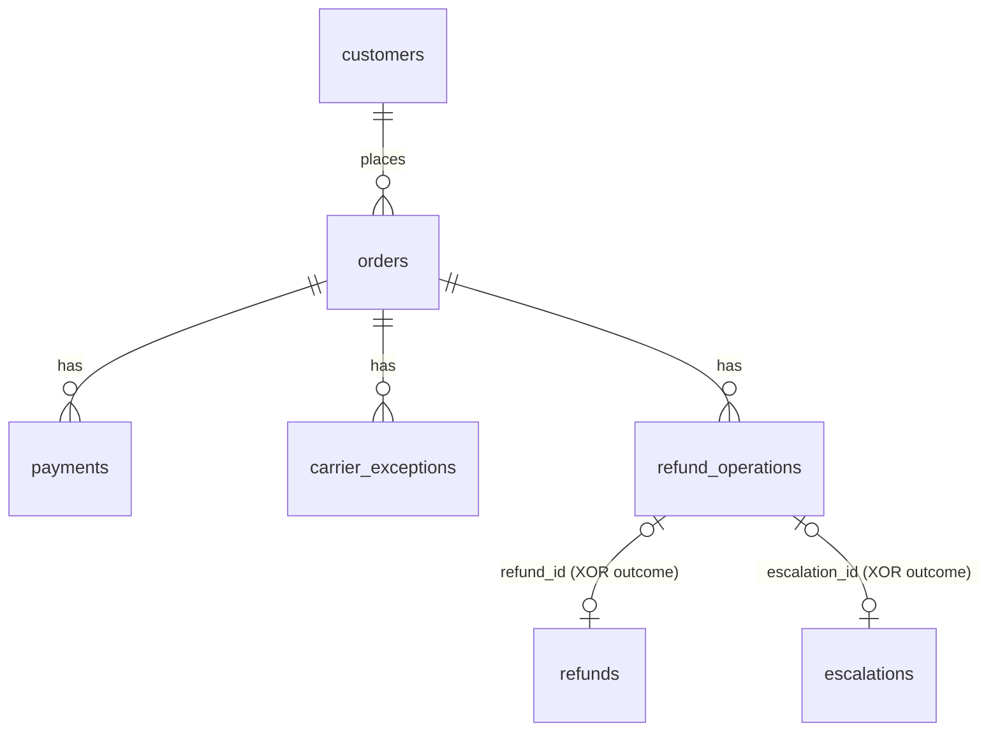

# Commerce-Ops MCP — Carrier-Exception Refund Resolution

An AI-native commerce operations tool built around a remotely-hosted **MCP
server**. It lets an operations or support person resolve
verified-carrier-exception refunds through an AI assistant: the AI either
**auto-executes a bounded refund** when a strict policy passes, or creates a
**manager-approval escalation** when it does not. No money moves outside the
policy, and every action is idempotent and durably recorded.

- **Live MCP endpoint:** `https://commerce-ops-mcp-viw5.onrender.com/mcp`
- **Health check:** `https://commerce-ops-mcp-viw5.onrender.com/healthz`
- **Stack:** TypeScript · MCP (Streamable HTTP) · Express · PostgreSQL (raw `pg`)

> All data is synthetic. The payment provider is a self-contained mock that
> mimics a real provider's idempotency behavior. No real credentials are used.

---

## Test it in 10 seconds (no setup)

The server is public. This previews the refund decision for a seeded order
without changing anything:

```bash
curl -s -X POST https://commerce-ops-mcp-viw5.onrender.com/mcp \
  -H "Content-Type: application/json" \
  -H "Accept: application/json, text/event-stream" \
  -d '{"jsonrpc":"2.0","id":1,"method":"tools/call","params":{"name":"get_refund_context","arguments":{"orderId":"ORD-1001"}}}'
```

> The free host sleeps after ~15 min idle; the first request may take ~50s to
> wake, then it is fast.

---

## The problem and the user

**User:** an operations/support person who fields "where's my refund?" cases but
cannot read the database or code. Today, resolving a carrier-exception refund
means pinging an engineer.

**This tool** lets them ask an AI assistant directly, and the AI uses the MCP to
investigate the order and either issue a safe refund or escalate it, with a
plain-English explanation of exactly why.

---

## The workflow

1. **Investigate** — the AI calls `get_refund_context` to gather the order's
   captured amount, amount already refunded, age, customer risk, whether a
   carrier exception is verified, and any prior refund. It returns a *preview*
   of the decision without acting.
2. **Resolve** — the AI calls `resolve_refund`. The six-condition policy is
   evaluated inside a transaction. If all pass, a refund is executed; if any
   fail, a manager-approval escalation is created and no money moves.
3. **Review** — `list_escalations` shows what is waiting for a human decision.

---

## The MCP tools

| Tool | Type | Purpose |
|---|---|---|
| `get_refund_context` | read | Gather all decision facts and preview the outcome, side-effect free. |
| `resolve_refund` | write | Evaluate the policy, then auto-refund or escalate. Idempotent. |
| `list_escalations` | read | List open escalations awaiting manager approval. |

### The refund policy (auto-execute only if ALL hold)

1. Amount is at most **$150**
2. **Cumulative** refunds (prior + this request) are at most the **captured amount**
3. Order is at most **30 days** old
4. Customer risk score is **below 70**
5. A carrier exception is **verified**
6. No existing refund covers the **same identity** (order + action + amount)

Any failing condition routes the request to a manager-approval escalation.

---

## Connecting an AI client

The server speaks MCP over **Streamable HTTP** at the `/mcp` endpoint.

**MCP Inspector** (quickest way to click through the tools):

```bash
npx @modelcontextprotocol/inspector
# In the UI: Transport = "Streamable HTTP",
# URL = https://commerce-ops-mcp-viw5.onrender.com/mcp  → Connect → List Tools
```

**Claude Desktop** (via the `mcp-remote` bridge) — add to
`claude_desktop_config.json`:

```json
{
  "mcpServers": {
    "commerce-ops": {
      "command": "npx",
      "args": ["mcp-remote", "https://commerce-ops-mcp-viw5.onrender.com/mcp"]
    }
  }
}
```

Then ask, for example: *"Why is order ORD-1008 not eligible for a $40 refund?"*

---

## Architecture & safety design

The MCP tools are thin; the **judgment lives in the server**. Three ideas do the
heavy lifting.

**1. Money is exact.** All amounts are integer cents (`BIGINT`), never floats.

**2. Idempotency is anchored on the refund's identity, not the caller's key.**

- `UNIQUE (order_id, action, amount_cents)` on `refunds` makes a duplicate
  refund of the same identity impossible **even under a different key**.
- The mock payment provider is idempotent by key (like Stripe), so retries do
  not move money twice.
- The caller-supplied `idempotencyKey` is a secondary layer that returns the
  original recorded outcome on retry.

**3. The cumulative ceiling is concurrency-safe.** A single refund must not push
total refunds past the captured amount. Two concurrent partial refunds could
each read a stale total and both pass, so every refund transaction locks the
order row (`SELECT ... FOR UPDATE`) before summing, serializing refunds per
order. Different orders still run in parallel.

Each resolve writes one `refund_operations` ledger row (the decision + reasons)
and exactly one outcome (a refund **or** an escalation), in a single
transaction. A `CHECK ((refund_id IS NOT NULL) <> (escalation_id IS NOT NULL))`
guarantees exactly one outcome per operation.

### Data model



Full entities, statuses, constraints, and invariants are in
[docs/data-model.md](docs/data-model.md).

---

## Local development

**Prerequisites:** Node 20+, PostgreSQL 14+ running locally.

```bash
# 1. Install
npm install

# 2. Create databases (defaults match the code)
createdb commerce_ops
createdb commerce_ops_test

# 3. Apply schema + seed synthetic data
npm run migrate
npm run seed

# 4. Run the server (http://localhost:3000/mcp)
npm run dev
```

Configuration is via environment variables (see [.env.example](.env.example)):
`DATABASE_URL` (defaults to `postgresql://localhost:5432/commerce_ops`),
`DATABASE_SSL`, and `PORT`.

### Tests

```bash
npm test        # 30 tests: unit (policy engine) + Postgres integration
```

The integration tests run against `commerce_ops_test` and cover the behavior
that matters: idempotency, the duplicate-identity guard, the cumulative ceiling,
the **concurrent** different-key ceiling race, and escalation-episode dedup.

---

## Deployment

The server is hosted on Render (free web service, Singapore) with a Neon
PostgreSQL database (Singapore), configured by [render.yaml](render.yaml). On
first boot the app applies the schema and seeds demo data automatically. Any
managed Postgres works; set `DATABASE_URL` accordingly.

---

## Product decisions, assumptions, and scope

**In scope:** one coherent workflow — resolving a verified-carrier-exception
refund end to end, with a safe auto-refund-vs-escalate decision.

**Assumptions:**
- Synthetic data and a self-built mock payment provider (mirrors how a real
  provider's idempotent refund API would behave).
- The AI is the MCP consumer; the ops person interacts through an AI client.

**Out of scope (deliberately):**
- Frontend, authentication, and a full commerce backend.
- Fulfillment and inventory mutations (escalate-only in a real system).
- The escalation **approval** workflow (approve/reject is a human step).
- Provider-failure reconciliation.

**Known limitation / next step:** refund `status = 'failed'` and provider-timeout
reconciliation are modeled in the schema but not exercised by the mock provider;
wiring a real provider (e.g. Stripe test mode) would use the same tool contracts.

---

## Project structure

```
src/
  server.ts              Express + Streamable HTTP transport (stateless)
  mcp.ts                 The three MCP tools (descriptions + schemas)
  domain/
    refund.ts            Pure six-condition policy engine
    money.ts             Integer-cents helpers
  db/
    schema.sql           Tables, enums, constraints, indexes
    pool.ts  migrate.ts  seed.ts  bootstrap.ts
    repo.ts              All SQL, parameterized
  services/
    refundService.ts     Transactional resolve: lock → decide → act
  integrations/
    mockProvider.ts      Idempotent mock payment provider
tests/                   Unit + Postgres integration tests
docs/data-model.md       Full data model, constraints, and invariants
```
